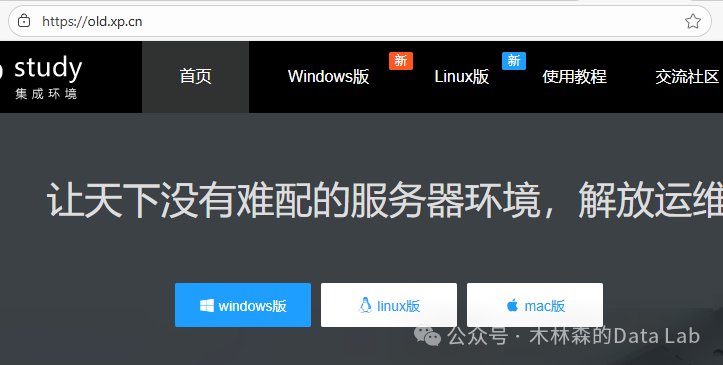
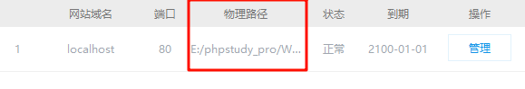
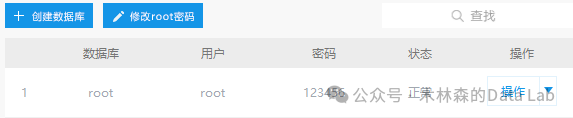
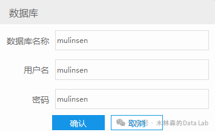
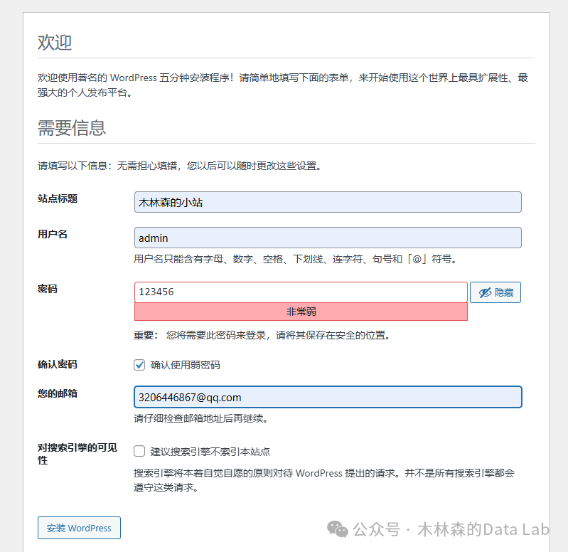
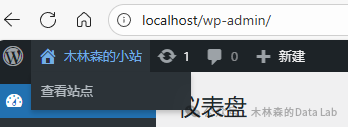
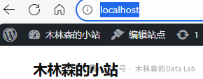

# 做一个自己的网站？快速上手无废话！

大家好，我是木林森，今天闲着看到b站首页推荐小枫社长的0到1搭建网站项目，自个上手发现确实ez，不过有几个点要注意，得兜的住时间成本。

教程链接：[BV1JBUVYNEgy](https://www.bilibili.com/video/BV1JBUVYNEgy)

**Q：为什么选择小皮面板**

**A：** free&free

想要自己的网址，是需要自己购买一个太阳系独一无二的域名，当然这步是可以 jump 的，在本地测试不需要这些。

---

## 第一步：下载辅助软件小皮

https://old.xp.cn/

根据自个的 os 下载：

tips：注意安装在无空格的目录，避开「Program Files」这种默认带空格的。

来都来了，顺便把 WordPress 的源码也下载了（25/12/03 已更新到 6.9 版本）：

https://wordpress.org/download/

---

## 第二步：初始化小皮

正常一键启动时，一般会问「80 端口被占用，是否尝试关闭？」

- **选否**：不影响自个的电脑使用 80 端口，可以在「网站」中右侧的「管理」改成别的比如 8080。
- 也可以不管原来的 80 端口，直接选「是」省事。

再次尝试启动，成功后可以：

打开网站～

---

## 第三步：用 WordPress 覆盖站点目录

接着用之前下载的 wordpress，选中 wordpress 文件夹里**全部内容** → 覆盖掉原来的物理路径里的所有内容。

完成后再次打开网站，即可进行初始化（包括语言选择等）。

---

## 第四步：数据库配置

回到小皮面板，点击「数据库」→「创建数据库」→ 改密码 → 改个记得住的比如 123456。

接下来创建自个的数据库，对应自个的网站，甭用 root 了，belike：

在用这份数据回填：

接着「运行安装程序」：

随意填写，除了 ✅「确认使用弱密码」、❌「建议搜索引擎不索引本站点」。然后「安装 WordPress」→「登录」。登录后可以点左上角「查看站点」：

或者直接在网址栏里输入 `localhost`（域名:端口 写 `localhost:80` 也行）。

搞定！

现在你已经有了一个能跑、能玩、能删库跑路的 WordPress 本地站了，剩下的就是你发挥的时间了。

（手动再见 👋）
